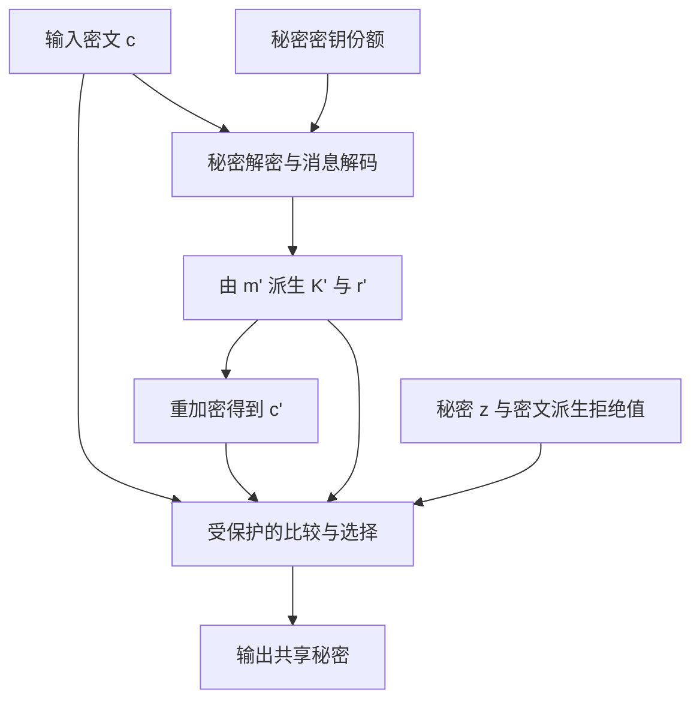
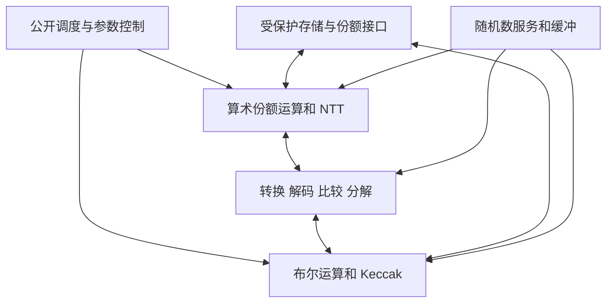

# 硬件侧信道与 NIST 后量子密码算法安全实现研究报告

## 摘要

后量子密码抵抗的是量子计算对数学难题的攻击；芯片在计算时泄漏的功耗、电磁辐射、时序和内部状态仍可能使密钥暴露。对硬件实现而言，算法符合标准、运行时间固定、使用一阶掩码以及通过一次 TVLA 测试，分别回答不同问题，不能相互替代。

本报告以**系统掌握知识并形成研究选题**为目标，重点讨论 ML-KEM 与 ML-DSA，补充 SLH-DSA，以及仍在标准化中的 Falcon 和 HQC。信息截点为 **2026 年 9 月 11 日**。标准状态依据 NIST 官方页面；攻击与实现结论优先依据原始论文。正文明确区分真实测量、局部硬件实验、软件平台、模拟结果和仅从原始摘要确认的结论。研究建议属于本文综合分析，不代表已经实现或验证的成果。

核心判断如下：

1. **ML-KEM 的重点保护对象是完整解封装数据流。** NTT/INTT、消息解码、算术与布尔掩码转换、重加密中的秘密派生值、密文比较和失败路径都需要连贯保护；只加固乘法器会留下明显缺口。[^s02][^s10][^s11][^s15]
2. **ML-DSA 的临时量与长期密钥同样重要。** 签名关系中的临时向量、采样与解包、秘密乘法、分解和拒绝判断，都可能把物理泄漏变成关于密钥的约束。算法中的随机签名机制不等于实现层面的掩码。[^s03][^s19][^s22]
3. **硬件攻击结论必须保留实验条件。** FPGA 上恢复若干系数、从裁剪后的解码模块恢复消息、在 Cortex-M 软件上恢复密钥，不能统称为“攻破完整 PQC 芯片”。[^s15][^s20][^s21]
4. **高阶掩码也需要检查模型与实现之间的距离。** 毛刺、寄存器转换、共享存储、非均匀份额和单次执行中的重复结构，可能使抽象安全证明不足以说明物理安全。[^s07][^s29]
5. **统一 ML-KEM/ML-DSA 掩码硬件已存在公开研究。** 2026 年的《Two birds, one mask》摘要报告了统一一阶掩码实现及 FPGA TVLA。因此，新的选题需要进一步落在随机数消耗、转换和存储接口、跨设备攻击评估、形式化与测量的一致性等具体问题上；不能仅以“统一两种算法并加掩码”作为新颖性主张。该工作的详细实验与开源版本仍需全文复核。[^s38]
6. **建议优先研究受随机数带宽约束的完整保护数据流。** 先用可复现的解码、转换或存储模块建立攻击基线，再验证新的设计能否在相同威胁模型下同时降低随机数开销和保持攻击难度。这比仅报告面积、频率或一个 t 值更有研究说服力。

## 1. 范围、标准状态与证据解释

### 1.1 哪些算法属于已经发布的标准

| 算法 | 对应标准与状态 | 数学结构和用途 | 本报告的重点 |
|---|---|---|---|
| ML-KEM | FIPS 203，2024-08-13 发布 | 模格；密钥封装 | 解封装、消息解码、重加密、掩码转换 |
| ML-DSA | FIPS 204，2024-08-13 发布 | 模格；数字签名 | 临时秘密、采样、NTT、秘密乘法、拒绝判断 |
| SLH-DSA | FIPS 205，2024-08-13 发布 | 无状态哈希签名 | 秘密种子派生、PRF、SHA-2/SHAKE 数据流 |
| Falcon | 已选中，标准化仍在进行 | NTRU 格签名 | 秘密采样与实现敏感性；不作为已发布 FIPS 分析 |
| HQC | 已选中，标准化仍在进行 | 准循环编码；密钥封装 | 固定重量采样、秘密相关数据流、解封装完整性 |

上述状态依据截至信息截点可访问的 NIST 官方说明；Falcon 和 HQC 的“已选中”不等于“最终标准已经发布”。[^s01] ML-KEM 的官方页面还列出了后续修订相关的勘误提示；实际实现应同时锁定标准正文、已公布勘误和测试向量版本，不能只保存最初的 PDF。[^s02]

文献中的 **Kyber、Dilithium、SPHINCS** 是重要的历史来源，但不应自动替换为最终标准名。迁移结论至少应核对算法版本、参数、编码、派生函数、随机数接口及实际实现。尤其不能把旧 Kyber 的 KDF 表达式直接当作 FIPS 203 的解封装流程。

### 1.2 两个独立的证据维度

论文的“在哪里测量”与“恢复了什么”必须分别记录。

| 平台证据 | 能直接支持的结论 | 不能自动支持的结论 |
|---|---|---|
| 完整目标设备实测 | 特定硬件、软件和采集条件下的攻击或泄漏 | 同算法所有实现都受影响 |
| 裁剪模块的 FPGA 实测 | 被保留数据通路的真实物理泄漏 | 完整 SoC 的可利用性、同样的信噪比 |
| 微控制器或应用处理器实测 | 对应指令、编译和存储行为的风险 | FPGA RTL 或 ASIC 门级实现已经被攻破 |
| 泄漏模型或门级模拟 | 模型假设下的可行性、设计问题线索 | 真实芯片的轨迹数与成功率 |
| 形式化分析 | 指定模型、组合规则和随机性前提下的性质 | 所有物理效应均被覆盖 |

攻击结果可依次标为：泄漏检测、单个中间值、部分系数、完整消息、会话密钥、长期私钥、等价签名能力。这个顺序只是记录粒度，**不是统一的危害排序**。例如，恢复一次重要会话的密钥已经具有实际影响，即使长期私钥仍未恢复。

“单轨迹攻击”通常指攻击阶段对目标秘密只需一条采集记录；它可能另外需要大量剖析数据、训练、已知标签或多个设备。“255,000 个训练片段”也不等于“255,000 次独立采集”。所有成本比较都应保留这些区分。

## 2. 硬件侧信道的物理与统计基础

### 2.1 为什么数学运算会变成可测信号

CMOS 电路的动态功耗可用近似关系理解：

$$P_{\mathrm{dyn}}\approx\alpha C V^2 f.$$

其中开关活动因子 $\alpha$ 与数据变化有关。该式用于解释机制，不能直接当作精确芯片模型。内部节点翻转、组合逻辑毛刺、时钟树、存储访问、寄存器写回和互连耦合都会进入实际测量。

对某一采样时刻，可用下式组织泄漏假设：

$$L_t=a\,\mathrm{HW}(v_t)+b\,\mathrm{HD}(v_{t-1},v_t)+N_t.$$

$\mathrm{HW}$ 是二进制中 1 的数量，$\mathrm{HD}(x,y)=\mathrm{HW}(x\oplus y)$ 是翻转数量。$N_t$ 包含其他逻辑活动和测量噪声。CPA 的经典模型研究明确讨论了与参考状态之间的汉明距离；“软件用 HW、硬件用 HD”只能作为经验线索，不能作为定律。[^s05]

一个小例子：寄存器从 `0000` 写入 `0011` 与从 `0010` 写入 `0011`，新值相同，但两次翻转数分别为 2 和 1。正确的分析不仅要猜当前值，也要知道或建模此前占据该物理资源的值。由此可见，指令顺序、流水线复用和清零策略都会改变泄漏模型。

### 2.2 观测通道与威胁场景

| 通道 | 典型观测 | 对 PQC 硬件的主要意义 | 关键限制 |
|---|---|---|---|
| 功耗 | 供电网络中的电流变化 | 重复运算、乘法、解码和存储的统计分析 | 整体噪声与多个并行模块混合 |
| 电磁 | 芯片或电路板附近的局部辐射 | 有机会区分空间位置和并行数据通路 | 探头位置、封装、距离和带宽敏感 |
| 时间 | 操作总时长、局部延迟 | 除法、分支、存储与协议路径差异 | 网络噪声可能掩盖本地可测差异 |
| 微架构状态 | 缓存、执行端口、共享资源等 | CPU 上的 PQC 实现或与加速器交互 | 不能直接套用到无同类资源的裸 RTL |
| 故障及响应 | 错误输出、执行跳过、异常处理 | 与侧信道联合形成密钥约束 | 属于主动改变计算，须独立建模 |

设备能力方面，应区分只能被动观察、能够提交选择输入、能在同型号设备上剖析、能在目标设备上用公开可生成的标签剖析，以及能够注入故障等情形。报告中涉及实验的研究设计均以授权测试设备为对象。

### 2.3 主要攻击方法

| 方法 | 从泄漏得到信息的方式 | PQC 中常见切入点 | 主要前提 |
|---|---|---|---|
| SPA / 横向分析 | 识别一次执行内的结构、重复操作或不同类别 | 采样、NTT 蝶形、重复哈希、条件处理 | 单次轨迹中有足够可重复结构 |
| DPA / CPA | 对秘密假设预测泄漏，再比较统计差异或相关性 | 秘密乘法、消息位、NTT/INTT 中间值 | 输入或部分中间量已知，可定义有效模型 |
| 模板攻击 | 在已知秘密的设备上估计条件分布 | 小范围系数、消息位、采样状态 | 训练分布能迁移到攻击环境 |
| 机器学习 / 深度学习 | 学习多采样点与秘密标签之间的关系 | 掩码组合泄漏、非线性特征、对齐误差 | 标签、训练数据和严格独立的测试集 |
| 高阶统计攻击 | 联合多个份额或多个时间点的泄漏 | 被掩码保护的运算 | 份额相关观测可被联合利用 |
| SASCA | 用概率图结合局部泄漏与算法约束 | NTT 网络、系数关系和运算依赖 | 局部概率模型及推断规模可控 |
| 侧信道预言机 | 把物理分类结果变成解密或明文性质判断 | KEM 重加密、消息解码 | 可查询输入，且判断与长期秘密有关 |

SASCA 不要求每个中间值都被准确识别。其价值在于多个较弱概率信息可通过算法约束相互补充。早期针对掩码格加密的单轨迹研究是这一方向的重要阅读入口，但其结论需要按当时方案和平台理解。[^s09]

### 2.4 CPA 的最小数学模型

给定已知输入 $u_i$、秘密候选 $k$ 和中间值函数 $F$，构造预测：

$$h_i(k)=\mathrm{HW}(F(u_i,k)),\qquad \rho(k,t)=\operatorname{corr}(h_i(k),L_{i,t}).$$

正确候选可能在某些时刻给出更高相关性，但也可能因模型错误、混合泄漏、掩码或不足的变化而没有明显峰值。一次没有峰值的实验既不能证明模型正确，也不能证明实现安全。

以下只是自行构造的模 17 算例，不是 ML-KEM 参数或实测数据。设秘密 $s=3$，观察 $v=u s\bmod17$，用 5 位表示：

| 已知 $u$ | 1 | 2 | 3 | 5 | 7 | 11 |
|---|---:|---:|---:|---:|---:|---:|
| $v$ | 3 | 6 | 9 | 15 | 4 | 16 |
| $\mathrm{HW}(v)$ | 2 | 2 | 2 | 4 | 1 | 1 |

这个例子说明输入变化如何使一个秘密假设变成预测序列。真实攻击还需要处理约简的内部表示、符号扩展、蒙哥马利域、多个乘法通道和寄存器旧值；只用最终模约简结果建模可能错过真正的泄漏。

### 2.5 泄漏检测不等于密钥恢复

Welch t 检验通常写为：

$$t=\frac{\bar{x}_1-\bar{x}_2}{\sqrt{s_1^2/n_1+s_2^2/n_2}}.$$

TVLA 常使用固定/随机或针对特定中间值的分组。常见的 $|t|>4.5$ 是检测实践中的阈值线索，不是“突破该值就恢复密钥”的定理，也不是“低于该值就有 128 位安全”。高阶、多变量检测、选取点的过程和统计条件都会影响解释。[^s06]

应同时防止两类误读：可公开输入引起的差异不一定泄漏秘密；有限样本没有显著差异也不意味着任何攻击都失败。测试大量采样点、反复选择最有利窗口，还会引入多重比较和选择偏差。正式评价应同时给出泄漏检测结果、攻击成功率、完整秘密恢复率、样本预算和置信区间。

## 3. 理解模格算法所需的最少数学背景

### 3.1 多项式、模数与 NTT

ML-KEM 与 ML-DSA 的核心运算均涉及次数小于 256 的多项式，但模数和变换结构不同：

| 项目 | ML-KEM | ML-DSA |
|---|---|---|
| 环 | $\mathbb{Z}_{3329}[X]/(X^{256}+1)$ | $\mathbb{Z}_{8380417}[X]/(X^{256}+1)$ |
| 参数族 | 512 / 768 / 1024 | 44 / 65 / 87 |
| 模块维度 | $k=2,3,4$ | $(k,\ell)=(4,4),(6,5),(8,7)$ |
| 变换特点 | 7 层不完全 NTT，保留成对系数的基乘结构 | 完整的 256 点负循环 NTT 结构 |
| 实现重点差异 | 12 位量级模数、压缩和解码 | 23 位量级模数、分解、提示位和拒绝判断 |

参数来自标准；统一硬件必须保留两种 NTT 的结构差异，而不能只切换模数。[^s02][^s03] 原因可从根的存在理解：3329 的乘法群阶不能提供所需的 512 次单位根，而 8380417 可以。由此产生的层数与基乘差异也改变了可观察的依赖图。

蝶形运算可抽象为 $(a,b)\mapsto(a+\omega b,a-\omega b)$。旋转因子 $\omega$ 通常公开，但 $a,b$ 可能含有秘密。因此，“乘的是公开常数”并不使该次乘法的功耗公开。反过来，并非每个 NTT 都需要相同保护：变换公开矩阵与变换秘密向量的威胁不同。

### 3.2 为什么掩码线性运算容易、非线性边界困难

算术掩码将 $x$ 写成 $x=x_0+x_1\pmod q$。若份额生成满足安全假设，单独份额不暴露 $x$。对公开常数 $c$，可分别计算 $c x_0$ 与 $c x_1$；线性变换同样可逐份额执行。

例如模 17 下取 $x=5$、均匀随机份额的一次取值 $x_0=9$，则 $x_1=13$。乘公开常数 3 后得到 10 和 5，二者之和模 17 为 15，与 $3x$ 相同。这里的 9 只是一次随机取值；不能为了节约随机数，让份额仅从很小的秘密系数集合中抽样。

难点发生在取位、阈值、舍入、比较、模数切换、布尔非线性、随机采样和跨模块组合。它们一般不能直接对每个份额做同样操作后重组。消息解码尤其典型：秘密值位于哪个区间是所需结果，却不能先把份额相加成明文值再比较。关于掩码比较和转换的专门算法文献因此是实现安全 PQC 的必读内容。[^s36]

## 4. ML-KEM：从物理泄漏到消息与密钥

### 4.1 完整解封装流程和秘密边界

忽略输入检查的展示细节，FIPS 203 内部解封装的关键关系可概括为：

$$\begin{aligned}
m'&=\operatorname{K\!\text{-}\!PKE.Decrypt}(dk_{\mathrm{PKE}},c),\\
(K',r')&=G(m'\parallel H(ek)),\\
c'&=\operatorname{K\!\text{-}\!PKE.Encrypt}(ek,m',r'),\\
\bar K&=J(z\parallel c),\\
K&=\operatorname{select}(c=c',K',\bar K).
\end{aligned}$$

合法密文走正常共享秘密，重加密不一致则使用隐式拒绝值。这里的 $m'$、$r'$、$K'$ 和 $z$ 都有保护意义；$ek$ 与 $c$ 是公开值也不会改变这一点。这个表示依据最终 ML-KEM，不能与旧 Kyber 的末端 KDF 形式混写。[^s02]

此图表达数据依赖，不表示必须实现为九个独立模块。设计审计的关键是：每一条带秘密数据的边是否保持份额、是否经过未保护缓冲、是否触发秘密相关调度。

### 4.2 攻击面地图

| 部位 | 可能被观测的秘密相关量 | 常见利用思路 | 保护重点 |
|---|---|---|---|
| 密钥装载与展开 | 种子、秘密多项式、份额 | 装载/采样泄漏，复用时的相关性 | 从输入到存储的份额连续性 |
| 秘密乘法与 INTT | 秘密系数或线性组合 | CPA、模板、SASCA、选择密文 | 模型覆盖蝶形、基乘、约简和存储 |
| 消息解码 | $m'$ 的位或相邻位关系 | 分类、模板、深度学习 | 安全比较、转换与流水线寄存器 |
| 重加密种子派生 | $m'$ 派生的 SHAKE 输入/状态 | 明文检查预言机 | SHAKE 和接口均保持保护 |
| 重加密和压缩 | 秘密随机量、中间多项式 | 恢复临时量或形成预言机 | 不能因为公钥公开而全部解除掩码 |
| 比较和隐式拒绝 | 相等性、回退种子 $z$ | 失败相关泄漏、错误路径差异 | 受保护比较与输出选择 |

### 4.3 选择密文为什么能放大泄漏

对解密核心，可用简化关系 $w=v-s^Tu$ 理解秘密进入何处。攻击者控制或影响密文中的公开输入，可能使某些中间值变稀疏、将某一秘密线性组合推到解码边界附近，或令复杂泄漏成为易分类的两个类别。这里仅是机制解释：实际构造必须遵循压缩编码、维度和目标攻击模型，不能由简式直接宣称完整密钥可恢复。

Hamburg 等的 k-trace 研究利用选择密文使 INTT 输入出现有利结构。在特定噪声模型下报告的少量轨迹结果很强，但其数量必须附带模拟泄漏和噪声参数，不能改写成“任何掩码 Kyber 芯片两次查询即破”。[^s10]

与之不同，重加密类攻击可以从 PRF/PRG 的泄漏构造明文检查预言机，继而连接底层 PKE 的主动攻击分析。《Curse of Re-encryption》说明 FO 变换在理想功能层的安全性，并不自动覆盖实现时秘密派生计算的物理泄漏；论文中不同受保护 PRF 的实验结果也不同，不能统称全部失效。[^s11]

### 4.4 消息泄漏与长期私钥泄漏是两条链

对于合法目标密文，若恢复完整 $m'$，公开的封装密钥和确定的派生流程可使攻击者计算对应共享秘密。这条链不必先恢复长期秘密多项式。

若目标是长期密钥，则通常还需要把可查询的密文与消息、解码或比较信息联系起来，累积关于秘密系数的约束。带噪声的预言机不等于无用：Shen 等用错误检测和自适应处理研究了不完美预言机，并在 Cortex-M4 的 Kyber-512 电磁实验中验证相关方法。其相对轨迹收益只对所比较的预言机准确率和基线成立。[^s12]

因此，评估报告应分别回答：能否识别一个消息位？能否恢复全部消息？对同一密文能重复几次？能否迁移到新密文或新设备？额外查询是否足以恢复长期密钥？这些问题不能由单个分类准确率代替。

### 4.5 代表性硬件证据

| 研究 | 平台和对象 | 可核验的主要结果 | 正确解读 |
|---|---|---|---|
| Carrera Rodríguez 等，PRIME 2023 | Kyber FPGA 多项式乘法，电磁 CPA | 文献报告 166,620 条轨迹恢复目标的全部子密钥 | 特定实现的非剖析攻击；不代表所有 ML-KEM 参数和芯片 |
| Ji、Dubrova，2025 | Kyber-512 一阶掩码解码模块，CW305 Artix-7；目标被裁剪 | 1,000 次剖析采集；同密文 399 次攻击采集时，同设备消息恢复率 99.7%，跨设备 94.8% | 恢复消息进而得到会话密钥；不是一次采集恢复完整长期私钥 |
| Xu、Wang、Tian，2024 v1 | Artix-7 上 Kyber 运算打乱 | 未保护 PWM 的 CPA 最低约 0.9k 条；所测保护设计到 100k 条未见相同成功 | 有限攻击预算下的实验提升；不能称不可攻破 |

来源分别为原始电磁攻击论文、掩码 FPGA 攻击全文及打乱方案 v1。[^s14][^s15][^s16] Ji、Dubrova 的 1,000 条完整轨迹被切成 255,000 个片段；两个数字描述不同成本。该论文还报告了在其单次封装场景下未达到相应完整消息恢复效果，应保留这一负面结果，而不能把解封装重复采集的收益推广到所有场景。

### 4.6 打乱、恒定时间和掩码各自保护什么

打乱将相关运算映射到不同时间位置，使对齐更难；但随机排列生成器、地址、循环结构和重复特征自身可能泄漏。Backlund 等研究了对掩码加打乱的 Kyber 与 Saber 实现的攻击。其摘要中的 4,608 条轨迹结果属于 **Saber**，不能移植为 Kyber 的攻击成本。[^s13]

KyberSlash 则提醒实现者：某些平台上的除法指令执行时间与秘密操作数相关，会破坏源代码层面对“恒定时间”的直觉。原始研究覆盖 Cortex-A7 与 Cortex-M4 等具体实现环境。这是相应软件实现的时序问题，不能据此宣称 FPGA NTT 天然存在同一漏洞，也不能断言已经修补的版本仍受影响。[^s17]

完整保护应叠加互补措施：固定秘密相关的执行行为，正确实现掩码，并在需要时添加隐藏或打乱；每一项都要有自己的评价基线。

## 5. ML-DSA：临时秘密、签名方程与硬件泄漏

### 5.1 从签名方程理解风险

用省略编码与上下文处理的核心关系表示：

$$t=As_1+s_2,\qquad w=Ay,\qquad \widetilde c=H(\mu\parallel w_1),\qquad c=\operatorname{SampleInBall}(\widetilde c),\qquad z=y+cs_1.$$

$s_1,s_2$ 为长期秘密，$y$ 是每轮签名尝试中的临时秘密，$c$ 是由哈希导出的稀疏挑战。公钥保存的是分解后的高位部分 $t_1$，不是未舍入的完整 $t$；低位部分 $t_0$ 属于秘密密钥材料。签名还需要界限判断、分解和提示位等步骤。[^s03]

这个方程解释了两条攻击路径：直接观察 $cs_1$ 或秘密 NTT 运算；或者观察 $y$ 的某些位、范围或采样状态，再利用公开签名中的 $z,c$ 建立秘密约束。第二条路径说明，临时量虽然只使用一次，依然可能比长期密钥存储更容易被利用。

这里有两个重要限制。第一，虽然消息通常可由攻击者选择，挑战 $c$ 受到哈希与签名过程约束，不能把它当作攻击者任意指定的系数向量。第二，获得 $s_1$ 的部分信息并不意味着可以立即从公钥精确算出 $s_2$；舍入与剩余秘密信息必须被处理。

### 5.2 从泄漏到密钥约束的小算例

下面继续使用自行构造的模 17 标量模型，仅说明信息如何相交。设公开 $z=12,c=3$，长期秘密候选 $s\in\{-2,-1,0,1,2\}$，则 $y=12-3s\pmod{17}$：

| $s$ 候选 | -2 | -1 | 0 | 1 | 2 |
|---|---:|---:|---:|---:|---:|
| 对应 $y$ | 1 | 15 | 12 | 9 | 6 |

若物理分类可靠地表明 $y\in\{6,7,8,9\}$，候选集合缩小为 $s\in\{1,2\}$。另一份独立约束可能继续缩小集合。真实 ML-DSA 中 $cs_1$ 是多项式运算，泄漏通常有误差，因此需要处理系数间耦合、概率信息以及可解性，而不是简单逐系数枚举。

这个算例还表明，秘密信息可以来自“范围”而非精确值。评价采样器只检查完整输出能否恢复，可能漏掉足以支持后续推断的部分信息。

### 5.3 签名数据流的保护地图

| 部位 | 风险机制 | 必须分清的情况 |
|---|---|---|
| 密钥或种子展开 | 秘密由 SHAKE 输出进入多项式和存储 | 公共矩阵展开与秘密展开不是同一保护等级 |
| 临时向量 $y$ 生成、解包 | 单比特、符号、范围或重复结构泄漏 | 算法随机量不是均匀的实现掩码 |
| $y$ 的 NTT 与 $Ay$ | 临时秘密的大量相关中间值 | 一次执行内的横向信息可能足够有用 |
| $cs_1$、$cs_2$、$ct_0$ | 长期秘密参与乘法、约简和写回 | 公共挑战仍会驱动秘密相关功耗 |
| 分解、取高低位、提示位 | 非线性边界和算术/布尔转换 | 输入敏感性和是否可公开必须逐项判定 |
| 拒绝和重试 | 判断依据、失败尝试中的临时秘密 | 正常重试不自动构成漏洞；额外相关泄漏需分析 |
| 签名输出和状态清理 | 失败结果或临时状态残留 | 只应输出标准允许公开的数据 |

关于 Dilithium 的敏感性分类和保护实现，Azouaoui 等提供了重要基础。其结论支持根据数据生命周期选择保护方式，而不是简单把“最后会公开”的值在整个计算期间都视为安全。[^s22]

### 5.4 有代表性的攻击研究

**临时量解包泄漏。** Marzougui 等针对 Dilithium 的剖析攻击表明，细小的位操作泄漏可结合机器学习及求解过程得到等价签名密钥。这类结果的重点是“泄漏如何连接签名方程”，而不只是神经网络分类准确率。本文从原始摘要确认其 Cortex-M4 场景和攻击性质，未以未核验的数字给出轨迹成本。[^s19]

**NTT 的剖析与相关分析。** Steffen 等的硬件研究报告了针对 NTT 初始阶段的剖析攻击及 CPA。原始摘要给出的约 700,000 条剖析轨迹与 1,101 条恢复系数对所需轨迹属于不同阶段；不能只保留后一个数字并称为完整私钥恢复成本。其 CPA 数量也必须与所恢复的系数和目标位置一起阅读。[^s20]

**并行硬件的干扰建模。** Wang 等在 Dilithium v3.1 的 FPGA 实现上分析多系数并行和 Keccak 活动对 CPA 的影响，研究如何定位兴趣点并处理其他数据通路的干扰。最低约 70,000 条轨迹对应部分系数恢复，不能作为完整密钥恢复的成本。该研究对统一加速器特别有启发：并行模块看似提供噪声，但其中可建模的部分可能被攻击者利用。[^s21]

### 5.5 随机签名、掩码和拒绝采样的关系

随机化或 hedged 签名机制用新随机输入降低某些重复执行或随机性失效的风险；掩码则将敏感计算拆成受保护的份额。两者的安全目标和资源消耗不同。随机签名有助于某些侧信道保护设计，但不会消除秘密乘法、取位和总线传输的泄漏。[^s22]

拒绝步骤参与保证签名分布及有效性。不能为了恒定总时间随意删除拒绝判断、强行输出超界结果，或在固定次数后输出带偏差的替代签名。合理研究方向包括保护判断的内部计算、明确异常重试的处理，并分析对外可观察的行为，而不是改变算法语义后仍称标准实现。

## 6. SLH-DSA、Falcon 与 HQC：不能忽略的不同攻击面

### 6.1 SLH-DSA：哈希安全不代表带密钥哈希计算不泄漏

SLH-DSA 使用无状态哈希签名结构，包含 FORS、WOTS+ 和多层树。标准提供 SHA-2 与 SHAKE 参数系列。秘密材料包括秘密种子和用于签名随机化的秘密 PRF 材料；公钥种子和根则可以公开。[^s04]

攻击分析应沿秘密派生过程展开：秘密种子何时进入哈希状态？多个签名之间哪些位置重复使用同一秘密？地址和公开输入变化是否提供建模优势？秘密派生结果经过何种缓冲和总线？不能因为最后公布了部分签名链值，就认定派生链上所有中间量都没有秘密价值。

Kannwischer 等在 2018 年对 XMSS 和 SPHINCS 的研究中，报告了旧 SPHINCS-256 中 BLAKE-256 PRF 的硬件功耗分析，并研究了 XMSS 的相关泄漏。这个证据说明“基于哈希的签名也有物理攻击面”，但所用 SPHINCS 版本和哈希函数与最终 SLH-DSA 不同，**不是 FIPS 205 全部参数的实测破坏**。[^s26]

对新研究，较清晰的方向是：在标准一致的 SHAKE 或 SHA-2 数据流中，研究秘密种子派生模块、重复调用的横向信息、受保护输入输出接口，以及跨签名攻击效果。其基线必须是最终算法，而不是仅复现历史 BLAKE 结果后更改标题。本文核验的来源尚不足以给出覆盖最终 SLH-DSA 完整 ASIC 的统一攻击轨迹数。

### 6.2 Falcon：秘密采样和数值实现需要单独研究

Falcon 与 ML-DSA 同属格签名，但其采样和数值运算路径不同，不能直接套用 ML-DSA 的均匀向量采样保护方式。

《SHIFT SNARE》针对 Falcon 第三轮实现中的**密钥生成采样**研究单轨迹侧信道，目标为 Cortex-M4 的相关软件实现。它说明细小移位和取符号行为也可能成为秘密恢复入口。该论文不能被概括为“所有 Falcon 签名 FFT 硬件单次可破”，也不能忽略攻击训练或模型建立成本；本文对其具体数字不作未核验的外推。[^s27]

掩码离散高斯采样的进展值得关注，但算法适用性需要逐一核对。例如 Maskaglia 讨论固定中心和固定标准差的采样方法；不能未经分析就把它当作 Falcon 所有采样环节的可直接替代模块，更不能把 ML-DSA 的临时向量采样误称为同一种高斯采样。[^s30]

### 6.3 HQC：固定重量采样与解封装的组合风险

HQC 的安全基础和数据结构与模格算法不同，官方方案围绕准循环编码问题构建。[^s28] 从实现角度，秘密相关固定重量采样、位置集合和重复处理结构值得重点分析；具体安全结论必须对应所用 HQC 版本，不能因名字相同便跨版本迁移。

Hesse 等对十阶掩码固定重量多项式采样给出无监督单轨迹攻击，并解释非均匀份额与噪声假设如何影响从 t-probing 模型到实践的推论。该结果针对相关采样构件，不应写成“最终 HQC 完整私钥已经被十阶掩码单次攻击恢复”。其更普遍的意义是：保护阶数、份额分布和观测模型需要一起报告。[^s29]

对 HQC 的研究选题可围绕采样和其调用环境展开，再连接解封装或协议级后果。先完成构件攻击不等于完整攻击链；从中间状态到秘密恢复所需的额外推断应作为独立结果呈现。

## 7. 故障攻击与侧信道的交叉

### 7.1 为什么需要区分主动与被动

功耗和电磁侧信道通常观察正常计算；电磁故障注入、时钟/电压扰动或内存位翻转则改变执行。两者可能使用相近设备或统计推断，却具有不同前提。芯片能抵抗一阶被动泄漏，不意味着能抵抗一处运算错误；故障检测有效，也不意味着观察多个正常份额无效。

联合威胁通常表现为：错误改变某个中间值，输出或是否接受提供额外分类；正常计算中的泄漏帮助定位秘密状态；故障是否生效本身又泄漏秘密相关信息。评价应分别报告注入次数、生效次数、可利用错误次数和最终恢复结果。

### 7.2 代表性证据及边界

| 研究 | 主动机制与目标 | 文献结果应如何表述 |
|---|---|---|
| Carry Your Fault，2024 | 掩码 LWE KEM 中 A2B 进位传播；STM32 上 EMFI | 文献报告约 190 万次注入的完整恢复实验；这是主动故障预算，不是功耗轨迹数 |
| Signature Correction Attack，2022 | Dilithium 错误签名、单比特故障与 Rowhammer 场景 | 报告恢复 3,072 个目标 $s_1$ 位中的 1,851 位；剩余部分仍有计算成本，不应写为零成本完整恢复 |
| End-to-End EMFI Analysis，2022 | Zynq 中 Cortex-A9 上的位切片软件 | Zynq 板卡实验不等于在 FPGA 可编程逻辑上攻击同名 RTL |

以上分别依据原始论文。[^s18][^s24][^s25] 这些研究支持在转换、错误检测和输出控制之间建立联合模型，但不能把特定注入条件下的攻击自动推广到所有设备封装和故障类型。

### 7.3 设计上的含义

冗余计算、控制流完整性、错误检测和故障后状态清理可以组成防线，但简单重复一遍同样的计算可能受到共同模式故障影响。检测逻辑本身也需要避免产生新的秘密相关输出。掩码证明与故障模型应分别建立，再讨论组合，而不是把“检测到错误就随机输出”视作无需证明的通用修复。

对于受资源限制的项目，可先声明只覆盖被动攻击并实现可靠结果；若引入故障能力，则明确扩展哪些攻击者能力和错误类型。研究边界清楚比宣称同时解决所有物理攻击更有价值。

## 8. 硬件防护：从安全构件到完整数据流

### 8.1 保护措施的作用与局限

| 措施 | 主要作用 | 常见失败方式 | 应提供的证据 |
|---|---|---|---|
| 恒定秘密相关时序 | 减少分支和延迟泄漏 | 指令或存储仍有数据相关延迟；功耗仍泄漏 | 目标平台上的时序分析与编译产物检查 |
| 算术/布尔掩码 | 避免少量观测直接组合出秘密 | 毛刺、转换错误、份额复用、存储转换 | 明确模型的构件证明与物理攻击评估 |
| 打乱 | 增加对齐和操作定位成本 | 排列生成或地址泄漏；结构可重新对齐 | 包含重对齐与横向分析的测试 |
| 随机延迟或时钟变化 | 扰动时间定位 | 可校正，或引入新的特征 | 对抗预处理后仍保留的收益 |
| 平衡逻辑与布线 | 减少数据相关开关差异 | 布局、负载、毛刺破坏平衡 | 物理实现后证据，不能只看 RTL |
| 隔离和清理秘密状态 | 限制残留与共享资源关联 | 清理过程本身泄漏；寄存器前值相关 | 资源复用与状态转换检查 |
| 查询限制与密钥生命周期控制 | 限制部分重复查询攻击 | 单次或横向攻击仍可能有效 | 与具体协议能力结合的攻击预算 |

不同措施可以组合，但成本和收益不一定相加。尤其不能把“打乱使攻击轨迹数增加约百倍”换算成新增 100 位或任意固定的密码安全位数。

### 8.2 毛刺与组合安全

逻辑上独立的份额可能在同一组合网络的瞬态行为中相遇。寄存器隔离、非线性构件的结构约束、新随机数和组合规则，是硬件掩码区别于简单“把运算复制两遍”的关键。DOM 是重要的硬件掩码设计路线，但其使用仍必须满足构件和组合所需条件。[^s07]

保护阶数 $d$ 常对应至少 $d+1$ 个份额，但份额数不是最终安全度。实际观察点可能整合多个节点，单次执行可能重复泄漏同一个秘密，非均匀份额可能使噪声要求增大。不能从“形式化工具通过”和“十阶”两个标签单独推出实物攻击成本。[^s29]

### 8.3 存储和总线往往是被低估的边界

为节约资源，硬件可能让两个份额先后使用同一寄存器、DSP、RAM 端口或总线。即使每次写入的单个份额分布良好，前值到后值的转换仍可能组合秘密关系。简单把寄存器先清零，可能改变泄漏而非消除它；额外寄存器也需要考察综合后是否被优化掉。

建议建立资源级表格，而不只建立算法级表格：记录每个共享资源何时处理哪一类份额，旧值来自哪里，是否存在跨运算或跨算法残留，随机刷新发生在什么位置。以下条件应成为设计审查对象：

- 不同份额是否通过同一个未建模的写回路径；
- 两种算法切换时，秘密状态是否仍影响下一次操作；
- DMA、输入 FIFO 和输出打包是否暗中重组份额；
- 复位、暂停、错误和时钟门控是否改变份额生命周期；
- 布局布线或综合优化是否违反安全构件边界。

这些是需要验证的设计风险，不意味着任何共享资源必然不安全。安全的复用方案可以研究，但必须给出明确条件与证据。

### 8.4 Keccak 保护不能只看置换核心

Keccak 的线性步骤可按份额处理，非线性 $\chi$ 需要适当保护；已有工作研究高阶受保护硬件实现。[^s08] 对 PQC 系统而言，同样重要的是秘密如何进入该核心，以及输出如何进入后续采样、转换和存储。

OpenTitan 官方 KMAC 文档给出一个具体例子：启用一阶掩码时使用 DOM 保护 $\chi$，在随机材料充足时每轮四周期、完整置换 96 周期；供应不足会停顿。文档还区分可携带份额的应用接口与普通消息路径。这个例子说明随机数供应、接口和流水线本身就是安全实现的一部分，不能仅以“集成了 masked SHAKE”概括整个系统。[^s34]

### 8.5 不能把性能架构论文当作完整防护证明

Sapphire 提供了真实硅实现的历史例子，并支持多种当时的格密码协议；其面向的算法版本、恒定时间及功耗分析保护目标，应与最终 ML-KEM/ML-DSA 的完整掩码验证区分。[^s33]

《Towards ML-KEM & ML-DSA on OpenTitan》研究 OTBN 扩展和直接 KMAC 接口，展示统一平台的性能及面积潜力，同时把部分完整掩码处理保留为后续工作。因此它是架构与接口的参考，不能单独作为“整个加速器已完成全面侧信道防护”的证据。[^s35]

2026 年《Two birds, one mask》则进一步报告完整统一的一阶掩码实现、转换、采样、解码与分解方面的集成，摘要称 FPGA TVLA 未检测到所测条件下的一阶泄漏，并声明公开代码和数据。本文确认了出版元数据和作者提交的原始摘要，但未核验全文、具体轨迹预算及仓库提交。因此将其列为必须精读的最新对比工作，暂不据此填写随机数带宽或面积领先幅度。[^s38]

## 9. 随机数受限的统一 ML-KEM/ML-DSA IP：研究设计

本节为基于前述证据提出的设计框架，**不是已验证的新架构或安全证明**。

### 9.1 应统一什么

模乘/模约简、NTT 调度、Keccak、份额存储和随机数服务具有共享潜力；但 ML-KEM 的基乘和解码，与 ML-DSA 的分解、提示位及签名拒绝路径，不能只用一个“多功能 NTT 核”概括。

建议以受保护的数据类型组织接口：模 $q$ 算术份额、布尔份额、公开量和显式允许公开的结果。模块只有在算法与证明允许的位置才能解除掩码。接口应同时表达份额数量、模数、有效周期、刷新要求和是否需要新随机材料。

图中的公开调度不意味着所有循环总长度固定；例如标准允许的签名重试需要专门处理。要求是敏感数据不能通过未经分析的额外调度行为暴露。

### 9.2 不要混淆熵、伪随机位和算法随机量

| 随机性来源或用途 | 应记录的内容 | 易犯错误 |
|---|---|---|
| 熵源 | 熵输入、健康监测、启动与故障条件 | 把输出位数直接当成等量真实熵 |
| 密码学 DRBG/PRNG | 种子保护、重播种、状态隔离、吞吐 | 用普通 LFSR 直接替代安全掩码随机性 |
| 算法随机量 | 密钥生成、封装、签名输入及各自分布 | 与实现掩码共用不受分析的序列或状态 |
| 掩码随机材料 | 份额生成、刷新、非线性构件所需位数 | 因 FIFO 不足而复用本应独立的新随机位 |
| 打乱随机量 | 排列空间、均匀性和可预测性 | 只统计种子长度，不分析实际排列覆盖 |

使用安全伪随机发生器扩展熵在工程上可以是合理设计；但必须说明采用计算安全假设还是信息论模型，以及发生器本身的保护边界。“每个掩码位都必须直接来自 TRNG”与“任意伪随机序列都能当掩码”都过于简单。

### 9.3 先统计平均消耗，再统计峰值与等待

设每次运算消耗 $B_{\mathrm{op}}$ 位掩码随机材料，目标吞吐为 $f_{\mathrm{op}}$ 次/秒，则平均需求为：

$$R_{\mathrm{avg}}=B_{\mathrm{op}}f_{\mathrm{op}}.$$

平均供应充足不代表峰值充足。令第 $n$ 个周期的供应和消耗分别为 $g_n,c_n$，以 FIFO 容量 $D$、余量 $b_n$ 表示，则在允许执行该周期的条件下：

$$b_{n+1}=\min(D,b_n+g_n-c_n),\qquad b_n+g_n\ge c_n.$$

不足时应按经过分析的策略停顿或预取，不能产生负余量后继续使用旧随机值。上述关系是自行提出的预算模型，不是某篇论文的性能测量。

例如，某假设构件每周期消耗 256 位、连续 8 周期工作，而供应仅 64 位/周期，则这一突发阶段需要额外预存 $8\times(256-64)=1536$ 位。是否允许期间补给、是否与其他模块争用，会进一步改变最小缓冲和时序。这种峰值分析比只报告“每次操作多少随机位”更接近芯片系统问题。

### 9.4 资源优化应保持的约束

可研究的优化包括降低转换次数、在安全允许时延长同一表示域的生命周期、复用公开数据计算、调整非线性模块并行度和优化随机材料调度。每项优化均应同时检查：是否改动独立性假设，是否产生跨份额转换泄漏，是否改变拒绝行为，是否使 DRBG 状态成为共同失效点。

推荐联合报告：面积或 LUT/FF/BRAM/DSP、吞吐与延迟、能耗、每次操作随机位数、峰值需求、FIFO 深度、停顿比例、保护阶数、形式化覆盖范围及攻击成功率。单一面积时间积可以辅助比较，但不能压缩掉安全模型和随机数条件。

## 10. 可复现的实验与评价方案

### 10.1 从最小可解释实验开始

建议先选择一个能与完整算法清楚连接的模块，例如 ML-KEM 消息解码或 ML-DSA 秘密乘法的数据通路。第一步验证功能与中间值一致性，第二步在未保护基线上找到可解释泄漏，第三步验证保护设计，最后回到完整系统，检查额外模块、接口和协议条件是否改变结论。

未保护基线的意义是校准采集与分析链。如果连预期明显泄漏的基线都无法分析，保护设计“没有相关峰”就难以解释。相反，攻击裁剪模块获得的成功也必须在完整系统中重新评价，不宜直接复制其轨迹数。

### 10.2 每个实验必须保存的最小记录

| 类别 | 记录内容 |
|---|---|
| 算法身份 | 标准或候选版本、参数集、测试向量来源、有效与无效输入类别 |
| 实现身份 | Git 提交、编译或综合版本、约束、布局布线结果、时钟、是否裁剪 |
| 防护配置 | 份额数量、保护模块列表、随机数来源、刷新规则、打乱策略 |
| 设备与测量 | 板卡/芯片编号、测量通道、探头位置、带宽、采样率、增益、触发范围 |
| 数据来源 | 密钥、输入和随机标签的生成方式；独立采集数与片段数 |
| 攻击能力 | 是否能重复目标密文、是否有剖析设备、是否可提交选择输入 |
| 分析过程 | 对齐、滤波、降维、兴趣点选择、模型训练和超参数固定方式 |
| 结果 | 消息/系数/密钥粒度、成功率、区间估计、运行时间与失败条件 |

记录敏感实验密钥时应使用可公开的测试材料，并明确其仅用于实验。数据发布要保留足以复现统计结论的元数据，不能只发布无法追溯来源的片段数组。

### 10.3 防止机器学习数据泄漏

切分训练和测试时，应按原始采集、密钥、会话和设备组织。先把同一条轨迹切成很多片段，再随机把片段分到训练与测试，可能使模型利用同次采集的共同噪声而高估泛化能力。

至少区分三类结果：同设备新采集，同型号新设备，不同会话或环境条件。标准化参数、兴趣点选择和超参数选择应只由训练/验证数据决定；最终测试集只用于最终评价。若使用目标设备进行适配，应单独计入适配采集预算。

给出位或系数准确率时，还应测量完整消息或密钥成功率。将每个位的准确率直接相乘隐含独立性，而实际错误可能相关。经验性的完整恢复统计通常比未经检验的独立性近似更可靠。

### 10.4 合理的预算与停止条件

以下数值仅为**建议的研究管理预算**，不是任何算法安全阈值或对攻击成功的承诺：

| 阶段 | 建议起点 | 进入下一阶段的依据 |
|---|---|---|
| 采集校准 | 千级独立采集 | 触发、信号变化和标签关系可解释 |
| 基线攻击 | 万级开始，按曲线增长 | 正确假设或秘密信息稳定优于对照 |
| 保护评估 | 根据预期攻击逐级扩展到十万级等预算 | 明确达到的预算、未决模型和统计区间 |
| 泛化评估 | 至少独立会话；条件允许时增加设备 | 结果对不同采集条件的稳定性得到量化 |

预算增长必须解决具体不确定性。例如已发现错误的转换实现，应先修复而不是继续堆积轨迹；某模型在明确预算内失败，则报告失败及模型边界。没有充分理由，不应把无限增加采集数当作唯一评价方法。

### 10.5 从门级到 FPGA，再到 ASIC

RTL 功能正确性、门级依赖分析、切换活动、布局后模拟、FPGA 实测和 ASIC 实测构成逐步收紧假设的证据链。它们不是彼此可替代的认证等级。

FPGA 的 LUT、可配置互连、DSP 和 BRAM 与 ASIC 标准单元的物理行为不同。将同一 RTL 移植到 ASIC 后，面积可能下降，但泄漏不一定按相同比例下降。若研究最终目标是 ASIC，应在论文中明确哪些结果来自综合估计、哪些来自流片测量，不能把前者表述为实物功耗安全。

## 11. 值得推进的研究选题

以下优先级是结合现有文献和实施可行性给出的研究判断。每个方向都需要在启动前核验最新论文、开源版本和已有专利/实现，不能据此直接声明“首次”。

| 优先级 | 方向 | 可检验的核心问题 | 最小可交付结果 | 最大风险 |
|---|---|---|---|---|
| A1 | 随机数受限的转换与非线性数据流 | 能否在相同保护模型下减少平均/峰值随机材料，同时不暴露接口泄漏 | 一个标准一致模块、随机数账本、证明与攻击对比 | 降耗实际来自削弱独立性假设 |
| A2 | 份额存储与跨算法资源复用 | 共享寄存器/BRAM/总线能否避免可利用的转换泄漏 | 明确复用规则、对照 RTL、跨算法切换测量 | 功能复用成功但物理模型遗漏旧值 |
| A3 | 单次与重复查询攻击的联合评价 | 打乱和掩码组合在横向、重对齐及跨设备模型下还剩多少收益 | 统一数据集与多攻击基线 | 仅对一个弱模型优化 |
| B1 | 形式化模型到实测的差距 | 哪些份额分布、毛刺和重复结构决定理论假设是否够用 | 小构件反例或正例、形式化与测量对应 | 结果只停留于模拟 |
| B2 | ML-DSA 临时秘密与拒绝数据流 | 采样、解包和分解如何影响端到端泄漏与成本 | 最终 ML-DSA 的敏感性表与受保护实现 | 把改变签名分布当优化 |
| C1 | 被动侧信道与故障的组合防御 | 在限定故障模型下，转换和错误控制能否同时保护 | 清晰联合模型与两类攻击证据 | 实验和证明范围迅速膨胀 |

### 11.1 推荐主线：从转换模块延伸到完整统一 IP

**假设。** 统一硬件的主要安全成本不只来自模乘器位宽，而可能由转换次数、受保护存储访问和随机数突发需求主导。通过减少不必要的域切换、安排份额生命周期及调整并行度，可以在不改变算法与安全假设的条件下改善资源效率。

**对照。** 至少与相同参数下的独立受保护模块、直接拼接的统一模块，以及已公开的统一掩码工作比较。2026 年《Two birds, one mask》必须纳入全文与代码层面的对照；在未核验其资源数据前，不应填写假想领先百分比。[^s38]

**消融实验。** 分别启用表示域优化、存储复用与随机数调度，再测组合方案。若同时更改太多模块，就无法知道收益来自哪一处，也难以解释新出现的泄漏。

**成功标准。** 标准测试正确；安全构件的假设没有弱化；在相同攻击模型和预算下，保护能力没有可观测退化；至少一个明确资源维度改善；所有额外缓冲、随机数服务和控制逻辑都计入成本。如果只得到无泄漏检测而未完成攻击评价，应据实报告阶段成果。

### 11.2 推荐配套主线：面向硬件的证据一致性

将“算法中间值—RTL 信号—物理资源—采样窗口—攻击标签”建立可追溯映射。这有助于解释为什么同一秘密的 HW 模型失败而 HD 模型成功，为什么模块裁剪改变结果，以及为什么某些布局约束影响泄漏。

这一方向可以先从很小的模块做扎实：给出一个具体泄漏机制、修复、代价和跨设备结果，比只有巨型统一 IP 的整体 t-test 更容易形成可检验的贡献。若随后扩展到完整系统，应保持同一套证据记录方式。

### 11.3 暂不建议作为唯一创新点的表述

- “第一次把 ML-KEM 与 ML-DSA 放进一个硬件核心”：已有统一架构和统一掩码研究，需要更具体的差异。
- “通过一阶 TVLA，因此抵抗所有侧信道”：检测范围不足以支持该结论。
- “使用更高阶掩码，因此物理安全自动提高到某一确定级别”：噪声、份额分布与实现模型仍需检查。
- “把 NTT 调度打乱即可保护整套算法”：解码、采样、SHAKE 和接口仍有独立攻击面。
- “改变模数或去掉拒绝以降低成本，仍算 FIPS 实现”：算法变体和标准一致实现必须分开讨论。早期 Masking Dilithium 包含算法变体的探索，阅读性能数字时尤其应区分这一点。[^s23]

## 12. 学习与研究推进路线

### 12.1 前 90 天

| 时间 | 学习与实现重点 | 可检查的产出 |
|---|---|---|
| 第 1–2 周 | FIPS 203/204 核心流程；功耗、HD/HW、CPA 和 TVLA | 算法数据流图、秘密生命周期表、两类数值算例 |
| 第 3–4 周 | 锁定一个模块与硬件平台；建立标准功能基线 | 版本固定的实现、测试向量对照、资源使用记录 |
| 第 5–6 周 | 未保护基线的泄漏采集和模型验证 | 解释得通的兴趣点和攻击结果；失败也保留原因 |
| 第 7–8 周 | 对照一种掩码实现，核对转换与存储 | 防护前后相同设置的比较与随机数消耗表 |
| 第 9–10 周 | 重复查询、片段切分、跨会话和跨设备评估 | 成本分开的攻击曲线与完整恢复率 |
| 第 11–12 周 | 收敛一个研究假设，核验最新工作的重叠 | 两页选题论证、基线差异、下一阶段实验清单 |

### 12.2 六至十二个月

前三个月结束时，应能回答“具体保护哪个秘密、哪个模块、哪种攻击者”。第四至六个月实现并验证一个有明确边界的改进，建立形式化假设与物理证据。第七至九个月根据实际结果扩展到完整 ML-KEM/ML-DSA 路径，或完成更强跨设备评价。第十至十二个月整理复现材料和研究写作；流片不是所有研究方向的必要前提，应由结论是否依赖 ASIC 物理效应决定。

### 12.3 推荐阅读顺序

| 顺序 | 阅读材料 | 需要带走的问题 |
|---|---|---|
| 1 | FIPS 203、204、205 | 哪些值是秘密，何时允许公开，算法版本如何锁定？ |
| 2 | Brier 等的 CPA；Schneider、Moradi 的泄漏评价 | 模型、统计显著性与可利用性分别是什么？ |
| 3 | Single-Trace Attacks on Masked Lattice-Based Encryption | 多个弱泄漏怎样与代数结构结合？ |
| 4 | k-trace Kyber；Curse of Re-encryption；Find the Bad Apples | 选择输入、预言机误差和协议能力怎样改变攻击成本？ |
| 5 | Ji、Dubrova 的 FPGA 解码攻击 | 训练、重复查询、模块裁剪和跨设备影响如何记录？ |
| 6 | Profiling Dilithium；两篇 Dilithium 硬件攻击 | 临时量、部分系数和等价签名密钥如何区分？ |
| 7 | DOM；Masked Keccak；Masked Comparison | 非线性构件的安全条件和随机数成本来自哪里？ |
| 8 | Protecting Dilithium；First-Order Masked Kyber on Cortex-M4 | 完整流程保护如何组织，软件基线能提供哪些启发？ |
| 9 | OpenTitan 论文与 KMAC 文档 | 受保护核心、总线接口和随机数服务如何衔接？ |
| 10 | Two birds, one mask；t-Probing (In-)Security | 最新统一工作已完成什么，模型与物理验证还缺什么？ |

作为软件防护对照，Heinz 等公开了基于 Cortex-M4 的一阶掩码 Kyber 实现；它有助于理解完整解封装的模块组合与成本，但不能当作 RTL 可直接复用的安全证明。[^s37]

## 13. 证据边界与仍需追踪的问题

本报告是一份有选择的深入研究综述，并非覆盖所有 PQC 实现论文的系统性元分析。标准与原始论文可以支持具体攻击机制和案例，**不能支持为每个算法给出一个不依赖实现的侧信道安全排名**。

部分来源只能核验原始摘要或出版方提交的元数据。这些文献在参考文献中标明核验范围；没有据此补写未知的芯片型号、保护阶数、成功率或轨迹数。最新统一掩码硬件工作的全文、开源代码提交和数据集细节，是后续选题比较中的首要待核验项。

对最终 ML-KEM/ML-DSA 的完整硬件，真正有用的后续证据包括：覆盖所有敏感边界的实现说明；既有非剖析也有剖析攻击；独立采集与片段数分开计量；跨设备结果；随机数生成和接口成本；明确的标准版本与参数。SLH-DSA、Falcon 和 HQC 也应使用同样口径，避免以历史方案或局部构件的证据替代最终系统结论。

## 参考文献与原始来源

以下网页访问日期统一为 2026-09-11。日期优先记录正式出版或所使用预印本版本；“摘要核验”表示本文没有据该来源全文推断额外实验细节。正文脚注链接到此处的完整出处。

[^s01]: NIST. **Post-Quantum Cryptography: Overview / PQC Standards / Ongoing PQC Standardization Process**. 官方项目页，更新 2026-08-05。[原文](https://csrc.nist.gov/projects/post-quantum-cryptography)。核验：官方页面；用于标准化状态。

[^s02]: NIST. **Module-Lattice-Based Key-Encapsulation Mechanism Standard**. FIPS 203，2024-08-13。[标准与勘误入口](https://csrc.nist.gov/pubs/fips/203/final)；[标准 PDF](https://nvlpubs.nist.gov/nistpubs/FIPS/NIST.FIPS.203.pdf)。核验：官方正文与发布页；未逐项复核勘误表。

[^s03]: NIST. **Module-Lattice-Based Digital Signature Standard**. FIPS 204，2024-08-13。[标准入口](https://csrc.nist.gov/pubs/fips/204/final)；[标准 PDF](https://nvlpubs.nist.gov/nistpubs/FIPS/NIST.FIPS.204.pdf)。核验：官方正文。

[^s04]: NIST. **Stateless Hash-Based Digital Signature Standard**. FIPS 205，2024-08-13。[标准入口](https://csrc.nist.gov/pubs/fips/205/final)；[标准 PDF](https://nvlpubs.nist.gov/nistpubs/FIPS/NIST.FIPS.205.pdf)。核验：官方正文。

[^s05]: Eric Brier, Christophe Clavier, Francis Olivier. **Correlation Power Analysis with a Leakage Model**. CHES 2004，pp. 16–29。[出版方原文](https://link.springer.com/chapter/10.1007/978-3-540-28632-5_2)。核验：原始摘要；用于 HD/CPA 基础。

[^s06]: Tobias Schneider, Amir Moradi. **Leakage Assessment Methodology — A Clear Roadmap for Side-Channel Evaluations**. CHES 2015；ePrint 2015/207。[原始预印本入口](https://eprint.iacr.org/2015/207)。核验：原始摘要；用于检测方法、阶数与解释边界。

[^s07]: Hannes Gross, Stefan Mangard, Thomas Korak. **Domain-Oriented Masking: Compact Masked Hardware Implementations with Arbitrary Protection Order**. ePrint 2016/486，2016。[原文](https://eprint.iacr.org/2016/486)。核验：原始摘要；用于 DOM 设计路线。

[^s08]: Hannes Gross, David Schaffenrath, Stefan Mangard. **Higher-Order Side-Channel Protected Implementations of Keccak**. DSD 2017；ePrint 2017/395，修订 2017-11-15。[原文](https://eprint.iacr.org/2017/395)。核验：原始摘要；用于高阶受保护 Keccak。

[^s09]: Robert Primas, Peter Pessl, Stefan Mangard. **Single-Trace Side-Channel Attacks on Masked Lattice-Based Encryption**. CHES 2017。[出版方原文](https://link.springer.com/chapter/10.1007/978-3-319-66787-4_25)。核验：原始摘要与出版信息；历史格加密研究，非最终 ML-KEM 直接测试。

[^s10]: Mike Hamburg, Julius Hermelink, Robert Primas, Simona Samardjiska, Thomas Schamberger, Silvan Streit, Emanuele Strieder, Christine van Vredendaal. **Chosen Ciphertext k-Trace Attacks on Masked CCA2 Secure Kyber**. TCHES 2021(4)，88–113，2021-08-11。[DOI 原文](https://doi.org/10.46586/tches.v2021.i4.88-113)。核验：出版方提交的原始摘要与元数据；少量轨迹结论保留噪声模型边界。

[^s11]: Rei Ueno, Keita Xagawa, Yutaro Tanaka, Akira Ito, Junko Takahashi, Naofumi Homma. **Curse of Re-encryption: A Generic Power/EM Analysis on Post-Quantum KEMs**. TCHES 2022(1)，296–322，首发 2021-11-19。[DOI 原文](https://doi.org/10.46586/tches.v2022.i1.296-322)。核验：出版方提交的原始摘要与元数据；未据摘要推断各方案统一轨迹数。

[^s12]: Muyan Shen, Chi Cheng, Xiaohan Zhang, Qian Guo, Tao Jiang. **Find the Bad Apples: An Efficient Method for Perfect Key Recovery under Imperfect SCA Oracles — A Case Study of Kyber**. TCHES 2023(1)，89–112；ePrint 2022/563，版本 2022-11-30。[原文](https://eprint.iacr.org/2022/563)。核验：原始摘要；包括模拟和 Cortex-M4 EM 实验。

[^s13]: Linus Backlund, Kalle Ngo, Joel Gärtner, Elena Dubrova. **Secret Key Recovery Attacks on Masked and Shuffled Implementations of CRYSTALS-Kyber and Saber**. ePrint 2022/1692，2022-12-06。[原文](https://eprint.iacr.org/2022/1692)。核验：原始摘要；4,608 条轨迹属于 Saber 结果。

[^s14]: Rafael Carrera Rodriguez, Florent Bruguier, Emanuele Valea, Pascal Benoit. **Correlation Electromagnetic Analysis on an FPGA Implementation of CRYSTALS-Kyber**. PRIME 2023；ePrint 2022/1361，修订 2024-07-24；DOI 10.1109/PRIME58259.2023.10161764。[原文](https://eprint.iacr.org/2022/1361)。核验：原始摘要与出版信息；166,620 条轨迹及目标子密钥结果按原文口径记录。

[^s15]: Yanning Ji, Elena Dubrova. **A Side-Channel Attack on a Masked Hardware Implementation of CRYSTALS-Kyber**. Journal of Cryptographic Engineering 15，Article 7，2025-04-02。[开放全文](https://link.springer.com/article/10.1007/s13389-025-00375-7)。核验：全文第 4–8 节，特别是目标裁剪、剖析集、重复次数与跨设备结果。

[^s16]: Dejun Xu, Kai Wang, Jing Tian. **A Hardware-Friendly Shuffling Countermeasure Against Side-Channel Attacks for Kyber**. arXiv:2407.02452，本文使用 v1，2024-07-02。[版本全文](https://arxiv.org/html/2407.02452v1)。核验：v1 全文的 FPGA 对比与 CPA 预算；不把后续版本的附加声明混入同一表格。

[^s17]: Daniel J. Bernstein, Karthikeyan Bhargavan, Shivam Bhasin, Anupam Chattopadhyay, Tee Kiah Chia, Matthias J. Kannwischer, Franziskus Kiefer, Thales B. Paiva, Prasanna Ravi, Goutam Tamvada. **KyberSlash: Exploiting Secret-Dependent Division Timings in Kyber Implementations**. TCHES 2025(2)，209–234，2025-03-04。[DOI 原文](https://doi.org/10.46586/tches.v2025.i2.209-234)。核验：出版方提交的原始摘要与元数据；适用性须按实现与修补版本判断。

[^s18]: Suparna Kundu, Siddhartha Chowdhury, Sayandeep Saha, Angshuman Karmakar, Debdeep Mukhopadhyay, Ingrid Verbauwhede. **Carry Your Fault: A Fault Propagation Attack on Side-Channel Protected LWE-based KEM**. arXiv:2401.14098，2024-01-25。[原文与作者信息](https://arxiv.org/abs/2401.14098)；[PDF](https://arxiv.org/pdf/2401.14098)。核验：原文摘要、攻击模型与实验概述；主动故障攻击。

[^s19]: Soundes Marzougui, Vincent Ulitzsch, Mehdi Tibouchi, Jean-Pierre Seifert. **Profiling Side-Channel Attacks on Dilithium: A Small Bit-Fiddling Leak Breaks It All**. ePrint 2022/106，版本 2022-02-09。[原文](https://eprint.iacr.org/2022/106)。核验：原始摘要；正文未引用未核验的轨迹数量。

[^s20]: Hauke Steffen, Georg Land, Lucie Kogelheide, Tim Güneysu. **Breaking and Protecting the Crystal: Side-Channel Analysis of Dilithium in Hardware**. PQCrypto 2023，688–711，2023-08-10。[出版方原文](https://link.springer.com/chapter/10.1007/978-3-031-40003-2_25)。核验：原始摘要；训练与系数对恢复成本分别记录。

[^s21]: Huaxin Wang, Yiwen Gao, Yuejun Liu, Qian Zhang, Yongbin Zhou. **In-depth Correlation Power Analysis Attacks on a Hardware Implementation of CRYSTALS-Dilithium**. Cybersecurity 7，Article 21，2024-06-03。[开放全文](https://link.springer.com/article/10.1186/s42400-024-00209-9)。核验：全文；最低轨迹结果属于部分系数恢复。

[^s22]: Melissa Azouaoui, Olivier Bronchain, Gaëtan Cassiers, Clément Hoffmann, Yulia Kuzovkova, Joost Renes, Markus Schönauer, Tobias Schneider, François-Xavier Standaert, Christine van Vredendaal. **Protecting Dilithium against Leakage: Revisited Sensitivity Analysis and Improved Implementations**. ePrint 2022/1406，修订 2023-04-12。[原文](https://eprint.iacr.org/2022/1406)。核验：原始摘要；用于敏感性分类和保护路线。

[^s23]: Vincent Migliore, Benoît Gérard, Mehdi Tibouchi, Pierre-Alain Fouque. **Masking Dilithium: Efficient Implementation and Side-Channel Evaluation**. ACNS 2019，344–362，2019-05-29。[出版方原文](https://link.springer.com/chapter/10.1007/978-3-030-21568-2_17)。核验：原始摘要；须区分原方案保护与修改模数的算法变体。

[^s24]: Saad Islam, Koksal Mus, Richa Singh, Patrick Schaumont, Berk Sunar. **Signature Correction Attack on Dilithium Signature Scheme**. arXiv:2203.00637，2022-03-01。[原文](https://arxiv.org/abs/2203.00637)。核验：原始摘要；部分秘密位恢复与剩余计算成本分开解释。

[^s25]: Richa Singh, Saad Islam, Berk Sunar, Patrick Schaumont. **An End-to-End Analysis of EMFI on Bit-sliced Post-Quantum Implementations**. arXiv:2204.06153，2022-04-13。[原文](https://arxiv.org/abs/2204.06153)。核验：原始摘要；Zynq 内 Cortex-A9 软件实验。

[^s26]: Matthias J. Kannwischer, Aymeric Genêt, Denis Butin, Juliane Krämer, Johannes Buchmann. **Differential Power Analysis of XMSS and SPHINCS**. COSADE 2018，168–188，2018-04-11。[出版方原文](https://link.springer.com/chapter/10.1007/978-3-319-89641-0_10)。核验：原始摘要；旧 SPHINCS/BLAKE 与最终 SLH-DSA 明确区分。

[^s27]: Jinyi Qiu, Aydin Aysu. **SHIFT SNARE: Uncovering Secret Keys in FALCON via Single-Trace Analysis**. arXiv:2504.00320，2025-04-01。[原文](https://arxiv.org/abs/2504.00320)。核验：原始摘要；密钥生成采样、Cortex-M4 实现。

[^s28]: HQC Team. **HQC — Hamming Quasi-Cyclic**. 官方方案网站，持续更新。[原文与规格入口](https://pqc-hqc.org/)。核验：官方页面；标准化状态另以 NIST 为准。

[^s29]: Dina Hesse, Jakob Feldtkeller, Tim Güneysu, Julius Hermelink, Georg Land, Markus Krausz, Jan Richter-Brockmann. **t-Probing (In-)Security — Pitfalls on Noise Assumptions**. ePrint 2025/1202，首发 2025-06-27，修订 2026-01-13；页面列为 TCHES 2026。[原文](https://eprint.iacr.org/2025/1202)。核验：摘要与原文前部；十阶固定重量采样构件，不等于完整 HQC 破解。

[^s30]: Calvin Abou Haidar, Thomas Espitau, Clément Hoffmann, Mehdi Tibouchi. **Maskaglia: A New, Efficient Approach to Masked Discrete Gaussian Sampling**. PKC 2026；作者机构页面 2026-07-09。[原始研究介绍](https://pqshield.com/publications/maskaglia-a-new-efficient-approach-to-masked-discrete-gaussian-sampling/)。核验：作者机构发布的原始摘要；采样分布适用性需逐项核对。

[^s33]: Utsav Banerjee, Tenzin S. Ukyab, Anantha P. Chandrakasan. **Sapphire: A Configurable Crypto-Processor for Post-Quantum Lattice-based Protocols**. TCHES 2019(4)，17–61；arXiv:1910.07557。[原文](https://arxiv.org/abs/1910.07557)。核验：原始摘要；历史算法版本与实际硅实现的证据分开记录。

[^s34]: OpenTitan Project. **KMAC HWIP: Theory of Operation**. 官方硬件文档，动态版本。[原文](https://opentitan.org/book/hw/ip/kmac/doc/theory_of_operation.html)。核验：Keccak Round、Masking、Message FIFO 与 Application Interfaces；后续复现应锁定对应提交。

[^s35]: Amin Abdulrahman, Felix Oberhansl, Hoang Nguyen Hien Pham, Jade Philipoom, Peter Schwabe, Tobias Stelzer, Andreas Zankl. **Towards ML-KEM & ML-DSA on OpenTitan**. IEEE Symposium on Security and Privacy 2025；作者稿 2025-05-14。[作者全文](https://cryptojedi.org/papers/otpqc-20250514.pdf)；[论文代码入口](https://github.com/PQC-OpenTitan/towards-ml-kem-and-ml-dsa-on-opentitan)。核验：原文架构与掩码边界；代码入口不代表本文已运行其实现。

[^s36]: Jan-Pieter D'Anvers, Michiel Van Beirendonck, Ingrid Verbauwhede. **Revisiting Higher-Order Masked Comparison for Lattice-Based Cryptography: Algorithms and Bit-sliced Implementations**. ePrint 2022/110，修订 2022-04-14。[原文](https://eprint.iacr.org/2022/110)。核验：原始摘要；算法比较主要针对 Cortex-M4，不直接当作 RTL 成本。

[^s37]: Daniel Heinz, Matthias J. Kannwischer, Georg Land, Thomas Pöppelmann, Peter Schwabe, Amber Sprenkels. **First-Order Masked Kyber on ARM Cortex-M4**. 作者报告，本文使用 2023-12-11 版本。[作者全文](https://cryptojedi.org/papers/maskedkyber-20231211.pdf)；[论文代码入口](https://github.com/masked-kyber-m4/mkm4)。核验：摘要与实现概述；软件完整流程的参考基线。

[^s38]: Patrik Dobias, Aikata, Azade Rezaeezade, Lejla Batina, Lukas Malina, Tomáš Gerlich. **Two Birds, One Mask: Side-Channel-Resistant Unified Hardware for ML-DSA and ML-KEM**. PeerJ Computer Science，2026-07-03，DOI 10.7717/peerj-cs.4003。[出版方入口](https://doi.org/10.7717/peerj-cs.4003)；[出版方提交的 Crossref 记录](https://api.crossref.org/works/10.7717%2Fpeerj-cs.4003)。核验：元数据和作者原始摘要；全文访问未成功，详细资源、TVLA 预算和开源提交尚待核验。
