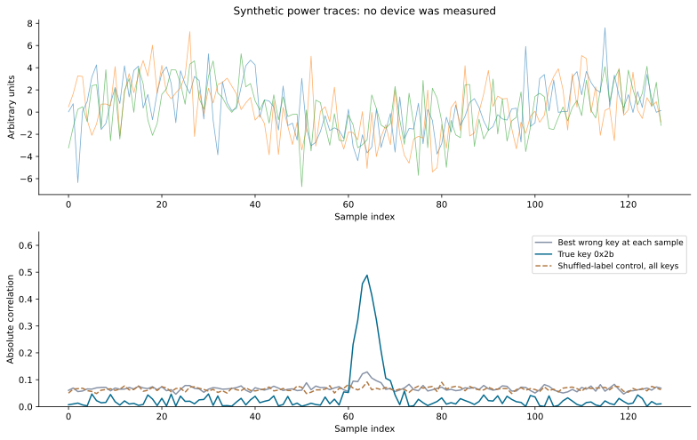
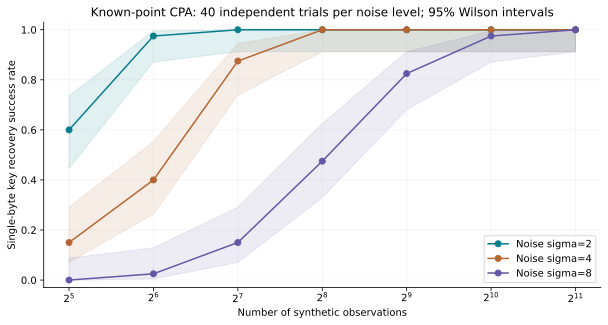
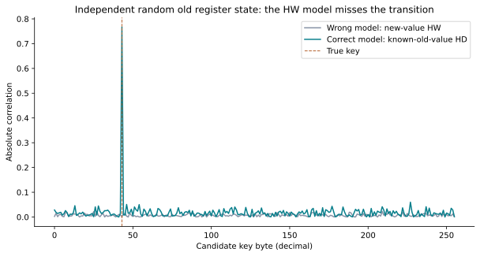
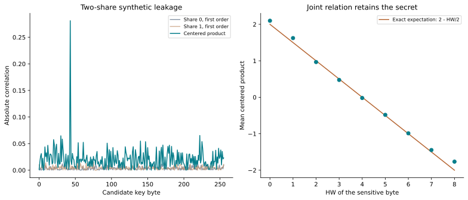
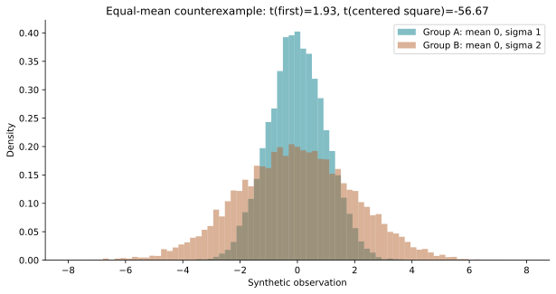

# 八个合成实验：把侧信道原理算出来

[返回教程](../README.md) · [运行脚本](run_experiments.py) · [机器可读结果](../results/summary.json)

这些实验只使用自建数据，不读取或攻击真实芯片。它们的作用是隔离一个机制、验证一条推导、观察一个反例。具体功耗形状、噪声、位置与旧寄存器值由模型指定，不能据此估计某块板卡需要多少迹线。

## 运行

在仓库根目录执行：

```bash
python -m pip install -r requirements.txt
python labs/run_experiments.py
```

Windows 可将 `python` 换成 `py`。默认种子为 20260911，噪声实验每档 40 次独立试验。可修改：

```bash
python labs/run_experiments.py --seed 20260912 --trials 80
```

每次运行会更新 `results/summary.json`、`results/noise_sweep.csv` 和 `figures/` 内的五张 SVG 图。参数变化后结果也会变化；文中的数值对应默认运行。JSON 记录 Python、NumPy、Matplotlib 版本。概率实验在极端随机抽样下可能有异常结果，不能把单次排名当作普遍定理。

## 实验一：AES 字节 DPA/CPA

生成 2048 条、每条 128 点的合成迹线，在第 64 点附近加入 `0.8 × (HW(Sbox(P⊕K))−4)`。比较全部 256 个密钥候选，并做打乱标签对照。

默认运行中，真实字节 `0x2b` 在 DPA 和 CPA 中均排第一。CPA 相关峰约 0.489，最佳错误候选约 0.129；标签打乱后全候选、全时刻最大值约 0.092。



**看图要点：**单条波形肉眼很难定位秘密；跨迹线的模型关系可以变得清楚。灰线逐时刻取最佳错误候选，不一定来自同一个候选。

**自己改一改：**把幅度 0.8 降到 0.4；把噪声标准差翻倍；给每条迹线的注入点加随机偏移。观察困难来自信号减弱还是对齐变化。这个扩展需要自行改代码，不是脚本默认执行的实验。

## 实验二：噪声和样本量

固定一个已知泄漏点，分别使用噪声标准差 2、4、8，对每档噪声运行 40 次独立实验。每次生成新的秘密、明文和噪声，对全部 256 个候选评分。



阴影为二项成功率的 95% Wilson 区间；即使 40 次全部成功，区间下界也不等于 100%。同一次试验的不同样本量使用迹线前缀，因此曲线上的各点不是彼此独立的实验。精确数据见 [CSV](../results/noise_sweep.csv)。

**看图要点：**噪声通常增加数据成本，不直接消除秘密关系。这里已经知道兴趣点；真实时间搜索、漂移和模型误差没有被包含。

## 实验三：HW/HD 模型错配与互补歧义

真实合成泄漏来自 `HD(old,new)`，旧寄存器值被设为独立均匀字节。在这个教学对手模型中 old 已知。

默认运行：HW 模型下真实候选排第 233；HD 模型下排第 1，相关约 0.767。



脚本还精确验证：`HW(P⊕k)+HW(P⊕(k⊕255))=8`，两条预测的相关为 −1，因此绝对相关无法区分这对候选。

**看图要点：**模型失败可能来自不辨识，不只是噪声。不能把 HW 失败解释成硬件安全。

## 实验四：一阶掩码与二阶组合

生成 40000 组双份额泄漏 A=HW(R)+噪声、B=HW(X⊕R)+噪声，其中 X 为 AES S 盒输出。先分别评分，再对中心化乘积评分。

默认运行：两个单份额的一阶模型中真实候选分别排第 221 和 160；中心化乘积中排第 1，相关约 0.281。



右图展示条件均值与理论 `2−HW(X)/2` 的关系；重量 0、8 等极端类别较少，有限样本均值会偏离理论直线。脚本另用全部 256×256 个 X、R 组合精确验证理论等式，不依靠这张散点图证明。

它还验证 `HD(R,X⊕R)=HW(X)`，说明同一物理节点连续写入两个份额会有不同于“单份额值独立”的风险。

## 实验五：TVLA 的同均值、不同方差反例

两组各 12000 个点，分布分别为 N(0,1) 与 N(0,4)。默认运行，一阶 t≈1.93，中心化平方的 t≈−56.67。



**看图要点：**均值检验看不到的结构，二阶特征可能看得到。这里没有模拟完整固定/随机采集流程，也没有给设备作出“通过/不通过”判定。

## 实验六：q=17 的 NTT 与逆蝶形

脚本检查 `(1,2,3,4)` 的长度 4 循环 NTT 为 `(10,7,15,6)`，逆变换精确恢复输入；蝶形 `(3,6)` 变为 `(10,13)` 后也能逆回。

这个实验体现可逆结构与局部约束，没有实现 ML-KEM 的不完全负循环 NTT。手算见[第 9 章](../docs/09-ntt.md)。

## 实验七：简化区间预言机

模 17、秘密候选 −2 到 2、理想区间输出。两次预定输入将候选缩小到 `{1}`。再对 204 个预定输入加入独立的 10% 翻转噪声，使用候选似然累计。

这个例子演示“一位分类怎样变成秘密约束”，没有解决如何在真实 ML-KEM 中产生相同接口、构造密文或跨越实现防护。解释见[第 10 章](../docs/10-ml-kem.md)。

## 实验八：简化签名临时量泄漏

使用标量关系 `z=y+cs mod17`。设 s=3、y=5、c=4，则 z=0。知道 y 后恢复 s=3。

实际 ML-DSA 在多项式环中运算，挑战未必可逆；部分和带噪声泄漏也不能当成完整 y。边界见[第 11 章](../docs/11-ml-dsa.md)。

## 已验证与尚未验证

已执行默认脚本、检查全部结果文件、目视检查五张图；验证了 S 盒的基本已知值与排列性、NTT 可逆性、掩码恒等式和玩具代数结果。

没有真实示波器/电磁采集、完整 AES 密钥恢复、ML-KEM/ML-DSA 实机攻击或硬件认证。后续进入实测时，需重新定义目标、测量链、输入条件和验证方法。
